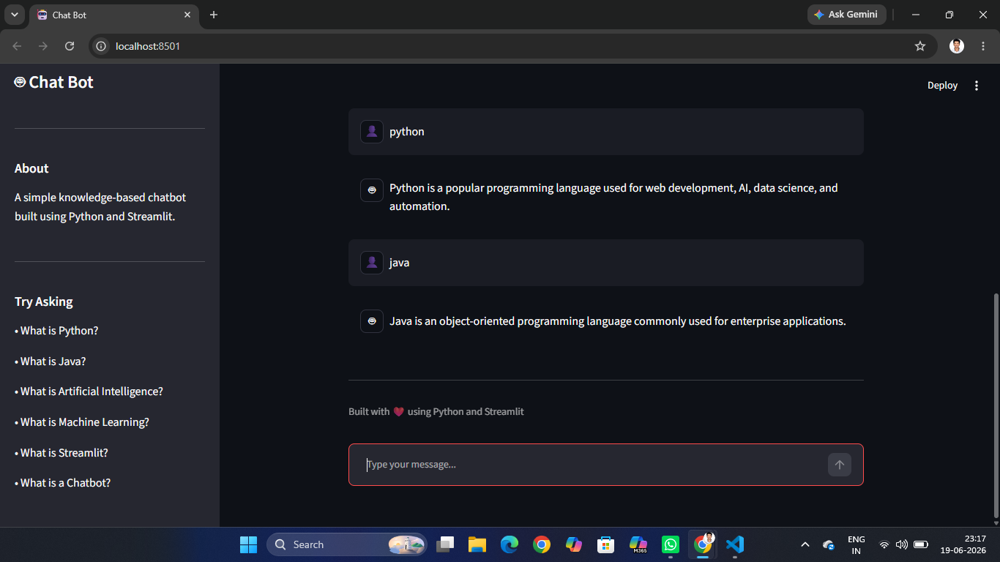

# 🤖 Chat Bot

A simple knowledge-based chatbot built using Python and Streamlit.

## 📌 Project Overview

Chatbot that responds to user questions using a predefined knowledge base. It demonstrates fundamental chatbot concepts such as user interaction, keyword matching, chat history management, and web-based interfaces.

## 🚀 Features

- Interactive chat interface
- Chat history management
- Knowledge base responses
- User and bot avatars
- Clear chat functionality
- Typing simulation
- Sidebar navigation

## 🛠️ Technologies Used

- Python
- Streamlit

## 📚 Knowledge Base Topics

- Python
- Java
- Artificial Intelligence
- Machine Learning
- Streamlit
- Chatbots

## ▶️ How to Run

### Clone Repository

```bash
git clone <repository-url>
```

### Navigate to Project

```bash
cd Simple-Chatbot
```

### Create Virtual Environment

```bash
py -m venv venv
```

### Activate Environment

```bash
venv\Scripts\activate
```

### Install Dependencies

```bash
pip install streamlit
```

### Run Application

```bash
streamlit run app.py
```

## 📸 Screenshot

Add a screenshot of the chatbot interface here.

## 👨‍💻 Author

Uma Maheswara Rao Vedurupaka

## Screenshot

